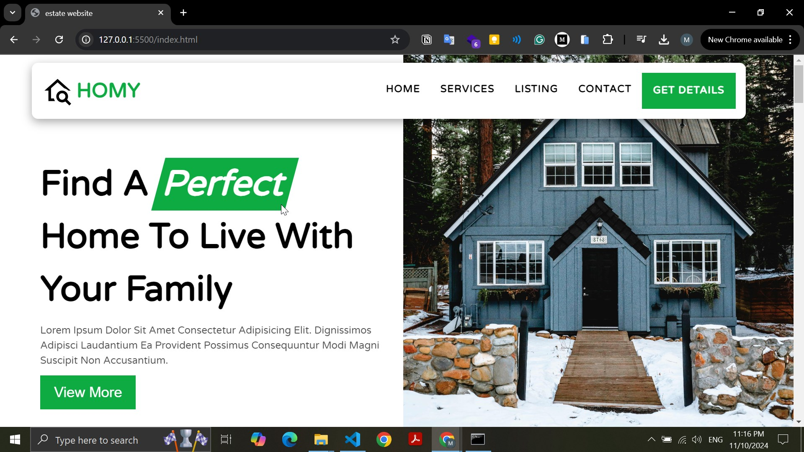

# HOMY - Find a Perfect Home

**Live Demo**: [GitHub Pages Link](https://mohamednaeemm.github.io/homy/)

## Project Description

**HOMY** is a responsive website designed to help users find the perfect home for their families. Built with HTML, CSS, JavaScript, and the ScrollReveal library, HOMY combines sleek visuals with smooth animations to create an engaging browsing experience.

### Features

- **Responsive Design**: Optimized for all screen sizes, from mobile to desktop.
- **ScrollReveal Animations**: Eye-catching animations triggered on scroll for a dynamic user experience.
- **Simple Navigation**: Intuitive layout and navigation to quickly access home listings and relevant details.

### Technologies Used

- **HTML**: For structuring content.
- **CSS**: For styling, layout, and responsiveness.
- **JavaScript**: For interactivity and dynamic elements.
- **ScrollReveal Library**: For implementing scroll-based animations.

